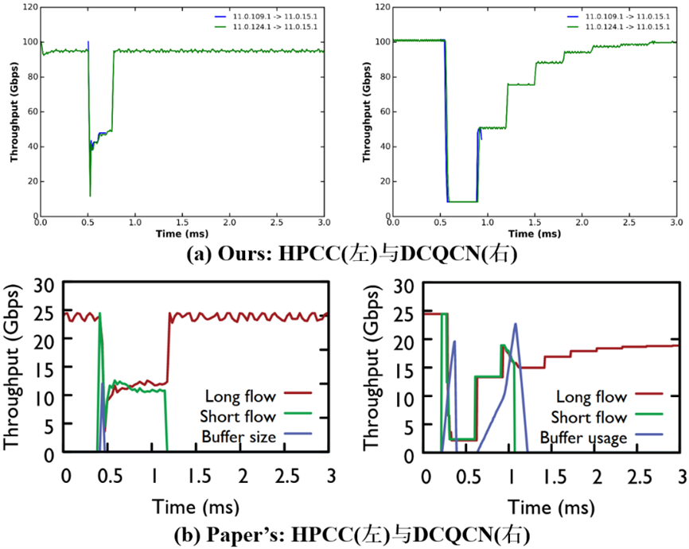
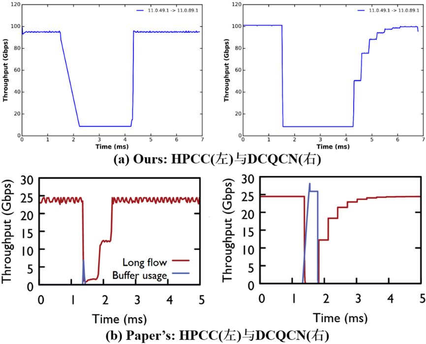
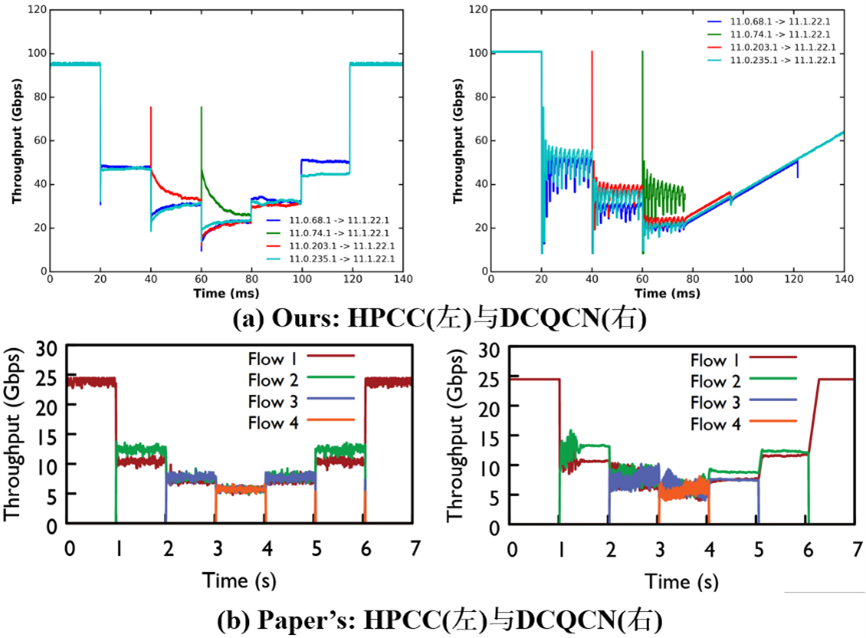
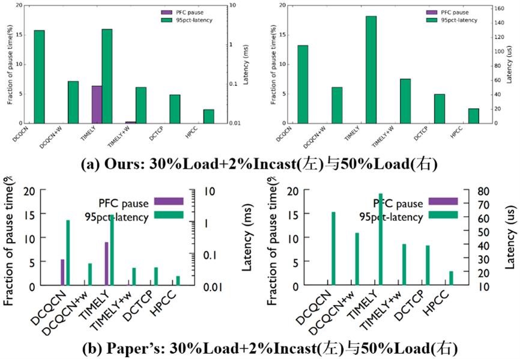
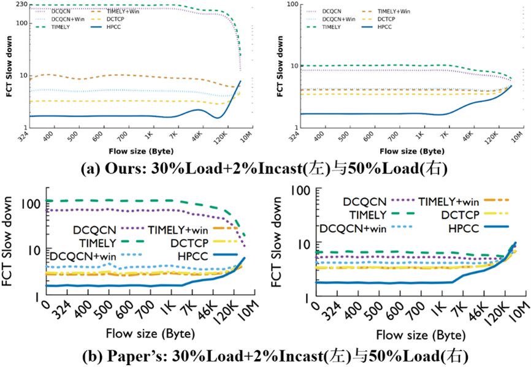

# An Improved Version of HPCC simulation (2026.1)
This is an improved simulator for [HPCC: High Precision Congestion Control (SIGCOMM' 2019)](https://rmiao.github.io/publications/hpcc-li.pdf). We add some functions based original [HPCC repo](https://github.com/alibaba-edu/High-Precision-Congestion-Control).

## Results Comparison between Ours and Paper's  
Below is a comparison of our simulation results with those presented in the paper.
### Micro-Benchmark Traffic Loads

> 图 1: Long-Short Results

> 图 2: Incast Results

> 图 3: Fair-Share Results
### Fb-Hadoop Traffic Loads

> 图 4: PFC-Latency Results

> 图 5: FCT Slow down Results

## NS-3 simulation
The ns-3 simulation is under `simulation/`. Refer to the README.md under it for more details.

## Traffic generator
We provide traffic generators for Long-Short Flow, Incast Flow and Fair Share Flow respectively. Furthermore, we have added functionality to generate incast flows in `traffic_gen/traffic_gen.py`. The traffic generator is under `traffic_gen/`. Refer to the README.md under it for more details.

## Analysis
We additionally provide some python script under `analysis/` for drawing figures as Figure 9 and Figure 11.
Refer to the README.md under it for more details.

## Set Up
```
git clone 
cd HPCC
conda env create -f environment.yml
conda activate HPCC
```

## Quick Start
```
cd ./HPCC/simulation/
CC='x86_64-conda_cos6-linux-gnu-gcc' CXX='x86_64-conda_cos6-linux-gnu-g++' python ./waf configure
python ./waf --run 'scratch/third mix/config.txt'
```
The above command executes a sample simulation using the predefined configuration file `config.txt`.
To run other simulations, such as HPCC or TIMELY, execute the `run.py` file with commands like:
```
python run.py --cc hp --trace FbHdp --bw 100 --topo fat --utgt 95 --mi 5 --hpai 80
```
This automatically generates the corresponding HPCC configuration file and executes the simulation experiment.
Consequently, should further simulations be required, the previously generated configuration file may be reused. The command would be:
```
python ./waf --run 'scratch/third mix/config.txt'
```
Simply modify the configuration file path within the command.

## Questions
Welcome to discussion by creating an issue in this repo!
